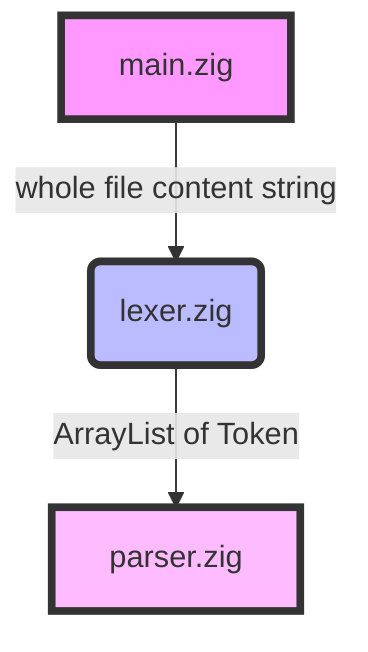

### A small and fast JSON validator 

Build the release version with: 
```bash 
zig build 
```

or, for the development version: 
```bash 
zig build -Denable-debug=true
```
which enables additional debugging logs throughout the code.


