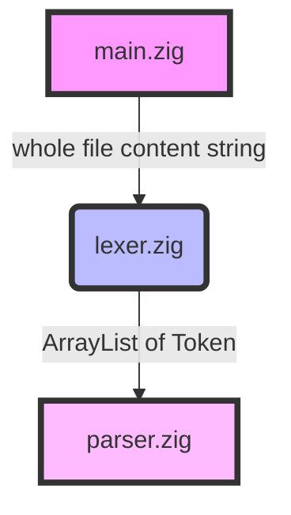

### A small and fast JSON validator 

Compile it with: 

```bash 
zig build 
```


```mermaid 
flowchart TD
    A[main.zig] -->|whole file content string| B(lexer.zig)
    B -->|ArrayList of Token| C[parser.zig]

    style A fill:#f9f,stroke:#333,stroke-width:4px
    style B fill:#bbf,stroke:#333,stroke-width:4px
    style C fill:#fbf,stroke:#333,stroke-width:4px
```